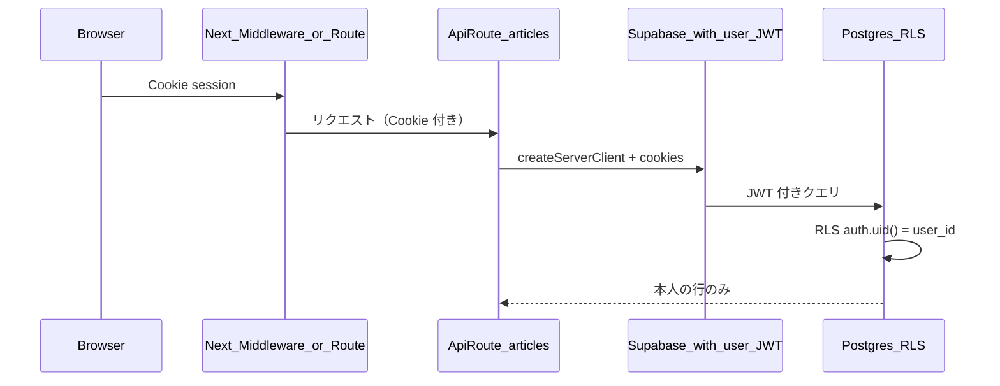

# tokutoku 認証追加：設計・実装計画（方針のみ）

## 1. 現在構成から見た変更点サマリ

| 領域           | 現状                                                                             | 変更後                                                                                                                                         |
| ------------ | ------------------------------------------------------------------------------ | ------------------------------------------------------------------------------------------------------------------------------------------- |
| DB           | `articles` に `user_id` なし、RLS 無効                                               | `user_id uuid` 追加（`auth.users` 参照）、RLS 有効                                                                                                   |
| サーバー DB アクセス | 全 API が `[createServiceClient()](lib/supabase/server.ts)`（service role）で全行アクセス | 記事系は **ユーザーの JWT が載ったクライアント**（anon key + Cookie セッション）でクエリし、**RLS で本人に限定**（service role は原則使わない）                                            |
| クライアント       | Supabase に直接接続しない                                                              | **ログイン／セッション更新**のため、`@supabase/ssr` ＋ Cookie（[Middleware](https://supabase.com/docs/guides/auth/server-side/nextjs) または Route Handler パターン） |
| 保護されていない画面   | 全員がトップ・一覧・詳細を利用                                                                | **未ログインは「ログインしてください」＋ログインボタン**、ログイン後は従来どおり URL 追加〜一覧                                                                                        |
| 環境変数         | `NEXT_PUBLIC_SUPABASE_URL` + `SUPABASE_SERVICE_ROLE_KEY`                       | 追加で `**NEXT_PUBLIC_SUPABASE_ANON_KEY`**（必須）。service role は **OGP 等・ユーザー非依存の Route のみ**に限定する想定が安全                                            |

データフロー（移行後のイメージ）:

---

## 2. Google ログイン導入方針（第一候補）

- **Supabase Dashboard** で Auth Providers の **Google** を有効化（Client ID / Secret は Google Cloud Console で取得）。
- **Redirect URL** に `https://<本番ドメイン>/auth/callback` と `http://localhost:3000/auth/callback`（開発用）を登録。
- アプリ側は **OAuth 開始**（`signInWithOAuth({ provider: 'google' })`）と `**/auth/callback` Route Handler** で `exchangeCodeForSession`（または PKCE フローに合わせた Supabase 推奨実装）を用意。実装は [Supabase + Next.js App Router 公式](https://supabase.com/docs/guides/auth/server-side/nextjs) に沿うのが最短。
- **Magic Link（Email）**: **主導線ではない**。Google の設定・挙動で詰まったときの **代替（保険）**として UI に残しておけば十分。磨き込みは不要。

### 動作確認の優先順（本プロジェクト）

**第一優先は Google 認証**と、それを前提とした **Redirect URL・ログイン・`user_id` / RLS 下の保存・一覧・詳細**である。

1. **Google Provider**（Supabase Dashboard：Client ID / Secret、Google Cloud Console 連携）。
2. **Redirect URL**（`http://localhost:3000/auth/callback` と本番の `/auth/callback` を **URL Configuration** に登録。Site URL も整合させる）。
3. `**.env.local`** に `NEXT_PUBLIC_SUPABASE_ANON_KEY` を追加済みであること（migration と合わせて先でも後でもよいが、ログイン〜API 検証前には必須）。
4. **Migration**（`20260328100000_articles_user_id_rls.sql` 等）適用済みであること。
5. **`/login` →「Google で続ける」**で `/auth/callback` 経由ログインが通ること。
6. **保存・一覧・詳細**が自分の `user_id` のみで動き、RLS が効いていること（別ユーザーの ID や未ログインでは期待どおりにならないこと）。

**Magic Link** は上記のいずれかで詰まったときのみ、Email プロバイダを有効化して代替確認に使う。

---

## 3. DB 変更方針（migration 案）

**カラム**

- `articles.user_id uuid not null references auth.users(id) on delete cascade`
- インデックス: `(user_id, created_at desc)` など一覧用（既存 `created_at` 単独に加えるか置き換えは負荷に応じて）

**既存データ（最低限）**

- 本番に既存行がある場合の選択肢（どれか一つを明示する必要あり）:
  - **A**: 開発用 DB なら **全削除**してから `NOT NULL` で再投入
  - **B**: 一度だけ `**MIGRATION_OWNER_USER_ID`（実在する `auth.users.id`）** に `UPDATE` で埋めてから `NOT NULL` 制約
  - **C**: 一時的に `NULL` 許可＋「移行用 RLS」は複雑になるため **非推奨**

MVP 移行では **A または B** のどちらかを README / 手順に書くのがよい。

**トリガー / updated_at**

- 既存の `[set_articles_updated_at](supabase/migrations/20260328000000_init.sql)` はそのまま流用可能。

---

## 4. RLS 方針

- `alter table public.articles enable row level security;`
- **方針**: `auth.uid() = user_id` を基本に、記事テーブルに対して:
  - **SELECT**: 自分の行のみ
  - **INSERT**: `user_id = auth.uid()`（クライアントから `user_id` を渡さず、**DEFAULT `auth.uid()`** または **トリガーで強制**すると改ざん耐性が高い）
  - **UPDATE / DELETE**: `user_id = auth.uid()`

**INSERT で `user_id` をクライアントに信頼させない**なら、例:

- 列 `DEFAULT` は使えない（`auth.uid()` は列 DEFAULT では不可）ので、**BEFORE INSERT トリガー**で `NEW.user_id := auth.uid()` を強制するか、API 層で必ず `auth.uid()` をセット（service role をやめる前提ではトリガーが堅い）。

**service role**

- 運用ポリシーとして「アプリの記事 CRUD では使わない」。**バッチ・メンテのみ**に限定。

---

## 5. API / middleware / Supabase client の再構成方針

**Supabase クライアント**

- 新規: `**createServerClient`**（`@supabase/ssr`）— `cookies()` または Route Handler の `request` / `response` から Cookie 読み書き。
- 既存 `[createServiceClient](lib/supabase/server.ts)`: **残す**が、利用箇所を **OGP などユーザー非依存 API** に限定（方針として明文化）。

**Middleware**

- Supabase 推奨どおり **セッションリフレッシュ**用の `middleware.ts`（matcher で静的ファイル除外）を追加するのが一般的。未ログインの **ページ全体ブロック**は middleware でも Route でもよいが、**「未ログインはトップでログイン促し」**なら、middleware は **セッション更新に寄せ**、表示制御は **レイアウト or ページ**でシンプルにする方が「過剰実装」を避けやすい。

**API Route（`/api/articles`, `/api/articles/[id]`）**

- 各ハンドラ先頭で **セッション取得**（`getUser()` 等）。未認証なら **401**。
- DB は `**createServerClient` + ユーザー JWT** で `select` / `insert` / `update` / `delete`。RLS と二重になるが、**API で `user_id` を明示フィルタ**するかは「RLS 一本に任せる」なら省略可（どちらかに統一すると読みやすい）。

`**/api/ogp`**

- 認証不要のままでよい（外部 URL fetch のみ）。service role のままでも、Supabase を触らなければ anon のみでも可。

**型・フロント**

- `[Article](types/article.ts)` / `[ArticleRow](types/article.ts)` に `userId` を追加するかはフロント表示次第（一覧に出さないなら省略も可）。

---

## 6. 実装ステップ（Phase 分割）

| Phase  | 内容                                                                                                                                       |
| ------ | ---------------------------------------------------------------------------------------------------------------------------------------- |
| **P0** | Supabase プロジェクトで Google Provider・Redirect URL 設定；ローカルに `NEXT_PUBLIC_SUPABASE_ANON_KEY` 追加（`[.env.local.example](.env.local.example)` 更新） |
| **P1** | Migration: `user_id` 追加＋既存データ方針（A or B）＋インデックス                                                                                           |
| **P2** | RLS ポリシー＋（推奨）INSERT 用トリガーで `user_id` 固定                                                                                                  |
| **P3** | `@supabase/ssr` 導入、`createServerClient` ヘルパー、`**middleware.ts`**（セッション更新）                                                                |
| **P4** | `**/auth/callback`** とログインボタン（トップまたは共通ヘッダー）、**ログアウト**（`signOut` + リダイレクト）                                                                |
| **P5** | `**/api/articles` / `[id]`** を service role から **サーバークライアント＋セッション**へ置換、未ログイン 401                                                         |
| **P6** | **未ログイン UI**（短い文言＋ログイン導線）、ログイン後は現行フロー維持                                                                                                  |
| **P7** | 軽い UI 調整（`[SiteLogo](components/site-logo.tsx)` 周りにログアウトを置く等）                                                                            |

（提示いただいた優先順位 1〜8 とほぼ一致させている。）

---

## 7. 破壊的変更になりそうなポイント

- **既存 `articles` 行**: `user_id` 必須化の前に **移行方針が必須**（全消し or 単一ユーザー UUID 付与）。
- **環境変数**: anon key 未設定では新クライアントが動かない。
- **Google OAuth**: リダイレクト URL ミスで **本番だけログイン失敗**しやすい。
- **service role を記事 API で使い続ける**と RLS をすり抜けるため、**移行完了後は記事系から完全に外す**（混在が一番危険）。
- **クライアントから Supabase 直接**はまだ使わない方針なら問題ないが、将来 PWA で直叩きするなら **RLS 必須**のまま anon + セッションで統一するのが一貫する。

---

## 8. 最小の実装順序（推奨）

1. Dashboard で Google 有効化＋ローカル Redirect 確認
2. **migration（user_id + データ方針）**
3. **RLS + トリガー**
4. **anon + `createServerClient` + middleware**
5. **callback + ログイン / ログアウト UI**
6. **記事 API をセッション前提に差し替え**（401）
7. **未ログイン時のトップガード**
8. 文言・ボタン位置の軽調整

---

## 補足（実装時に決めるとよい 1 点）

既存データを **削除してよいか**、それとも **1 人分の UUID に寄せるか**だけ、チームで先に決めると migration が一本化できる。